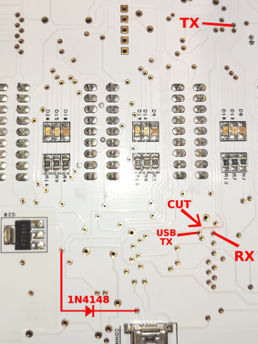

# ESP8266 Wattson hardware hacking and the circuit

To connect the ESP8266 to Wattson's internal serial line, the soldering points are in the photo below.

- Connect ESP8266:s GPIO12 to the point marked as TX.
- Connect ESP8266:s GPIO13 to the point marked as TX.

Cut the lead near the point marked as USB TX. If you want to put eg. a toggle switch that you can choose
between ESP and USB, connect it to USB TX etc.

