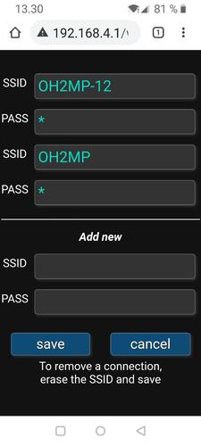
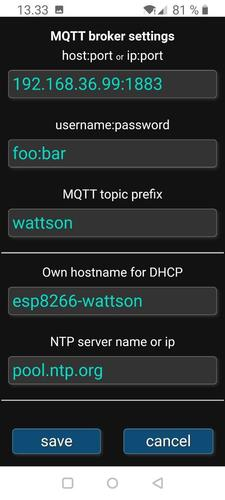

# ESP8266 Wattson

__ESP8266 based MQTT gateway for DIY Kyoto Wattson__

[DIY Kyoto Wattson](http://www.diykyoto.com/uk/aboutus/wattson-classic) is a wireless three phase Electricity 
monitor that came to market about 2010. The manufacturer did not provide other software than "Holmes" for 
Windows. Then I reverse engineered the serial protocol in 2011 and wrote a 
[Linux daemon](https://pikarinen.com/rrdwattsond/) for it. The daemon worked well all these years 
but I got an idea that it should use just ESP8266 and MQTT. The graph could be drawn by Grafana.

The device has a Mini-USB connector and looks as a generic USB serial port with 19200 8N1 to the computer.
I thought that the ESP could be connected directly to the serial line of the device "after" the USB circuit.
That was a quite easy hack. See __[Hardware.md](Hardware.md)__.

The sketch sends the current power consumption with MQTT every 3 seconds. It also keeps it internal clock
in UTC with NTP. The MQTT packet is a JSON like this example:

`{"type":8,"p"=1234000}`

The __type=8__ comes for my "standard" that is explained at
[ESP32 BLE2MQTT docs](https://github.com/oh2mp/esp32_ble2mqtt/blob/main/DATAFORMATS.md) and parameter __p__ is
power in milliwatts.

It will add the device's serial number at the end of the topic. Eg. if the topic base is set as __wattson__
and the serial number is s123456, the MQTT topic will be __wattson/s123456__

There you can find also an [example](https://github.com/oh2mp/esp32_ble2mqtt/blob/main/CONFIG_EXAMPLES.md) 
how to configure Mosquitto, InfluxDB and Telegraf.

-----------

## Portal mode

This contains a quite similar portal as many other of my ESP sketches. If the GPIO14 is grounded, the ESP 
switches to the portal mode. Connect to WiFi __ESP8266 Wattson__, accept that there's no internet 
connection and take your browser to `http://192.168.4.1/`

The portal mode has a timeout. The unit will reboot after 2 minutes of inactivity. There's almost no 
sanity checks for the data sent from the forms. This is not a public web service and if you want to mess 
up your board or try to make a denial of service using eg. buffer overflows, feel free to do so.

### Sample screenshots from the portal

------
